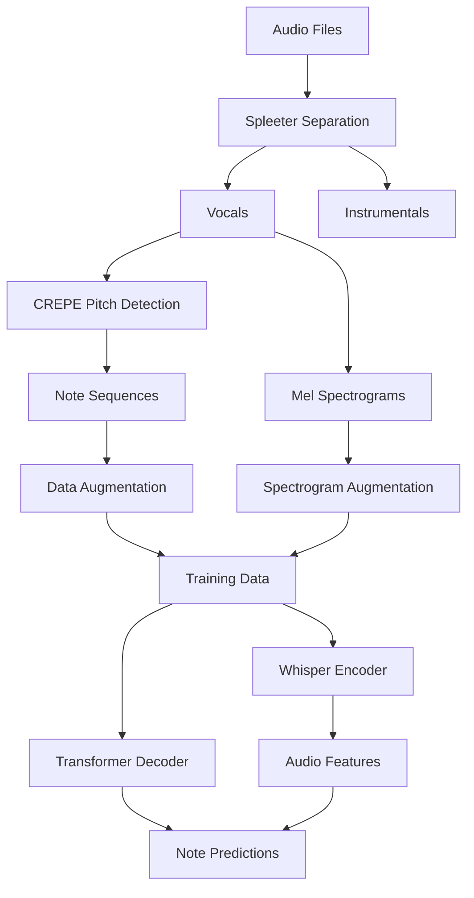

# 🎵 Vocal to Song Generator - Simple Web Interface

This project includes a simple, all-in-one web interface to generate music from your vocals.

## 🚀 Quick Start

### 1. Install Dependencies

If you haven't already, install the required Python packages. You will need `Flask` for the web interface.

```bash
pip install -r requirements.txt
pip install Flask==2.3.3
```

### 2. Run the Application

Start the simple web server with one command:

```bash
python simple_vocal_generator.py
```

### 3. Use the Web Interface

- Open your browser and navigate to **http://localhost:5454**.
- The application will automatically load the model from `checkpoints/best_model.pt`.
- Click to upload your vocal audio file.
- Adjust the settings (creativity, volume).
- Click "Generate Song".
- Play and download your new song directly from the browser!

---

# 🎵 Song-to-MIDI AI

A comprehensive AI system that converts songs into MIDI note sequences using a Whisper encoder and transformer decoder architecture.

## 🚀 Features

- **Audio Processing**: Separates vocals from instrumentals using Spleeter
- **Note Extraction**: Extracts detailed note information (pitch, timing, amplitude) using CREPE
- **Whisper Encoder**: Processes mel spectrograms for audio understanding
- **Transformer Decoder**: Generates MIDI note sequences autoregressively
- **Data Augmentation**: 100x data augmentation for robust training
- **Comprehensive Training**: Full training pipeline with monitoring and checkpointing

## 📁 Project Structure

```
SongToMidiAI/
├── Input/                    # Place your audio files here
├── processed_data/           # Generated processed data
├── checkpoints/             # Model checkpoints
├── logs/                    # Training logs
├── data_processor.py        # Audio processing and augmentation
├── dataloader.py           # PyTorch data loading
├── model.py                # Whisper encoder + transformer decoder
├── train.py                # Training script
├── karaoke_helper.py       # Original vocal extraction utilities
├── requirements.txt        # Dependencies
└── README.md              # This file
```

## 🛠️ Installation

1. **Clone the repository**
```bash
git clone <repository-url>
cd SongToMidiAI
```

2. **Install dependencies**
```bash
pip install -r requirements.txt
```

3. **Download pretrained models** (if using Spleeter)
```bash
python -c "from spleeter.separator import Separator; Separator('spleeter:2stems')"
```

## 🎯 Quick Start

### Step 1: Prepare Your Data
Place your audio files (MP3, WAV) in the `Input/` directory.

### Step 2: Process Audio Files
```bash
python data_processor.py
```

This will:
- Extract vocals and instrumentals from each song
- Generate note sequences using CREPE pitch detection
- Create Whisper-compatible mel spectrograms
- Apply 100x data augmentation
- Organize data for training

### Step 3: Train the Model
```bash
python train.py --epochs 50 --batch_size 16 --lr 1e-5
```

Optional arguments:
- `--config`: Path to JSON config file
- `--resume`: Resume from checkpoint
- `--data_dir`: Processed data directory
- `--device`: Device to use (auto/cuda/cpu)

### Step 4: Monitor Training
```bash
tensorboard --logdir logs
```

## 📊 Data Flow



## 🏗️ Architecture

### Whisper Encoder
- **Input**: Mel spectrograms (80 mel bins, 16kHz)
- **Architecture**: Convolutional layers + Transformer encoder
- **Output**: Encoded audio features

### Transformer Decoder
- **Input**: Previous note sequences + encoded audio
- **Architecture**: Multi-head attention transformer
- **Output**: Next note predictions

### Note Representation
Each note is represented as a 6-dimensional vector:
1. **Token type**: START/END/PAD/SILENCE
2. **Start time**: Note onset (seconds)
3. **End time**: Note offset (seconds)
4. **Pitch (Hz)**: Fundamental frequency
5. **MIDI note**: Quantized pitch (0-127)
6. **Amplitude**: Note volume (0-1)

## 🔧 Configuration

Create a `config.json` file to customize training:

```json
{
  "n_mels": 80,
  "n_audio_ctx": 1500,
  "n_audio_state": 512,
  "note_features": 6,
  "max_seq_len": 512,
  "learning_rate": 1e-4,
  "batch_size": 16,
  "num_epochs": 50,
  "augmentation_factor": 100
}
```

## 📈 Data Augmentation

The system applies extensive augmentation:

### Audio Augmentation
- **Time stretching**: ±20% tempo variation
- **Pitch shifting**: ±5 semitones
- **Amplitude scaling**: ±30% volume variation
- **Timing jitter**: ±10ms random timing
- **Note dropout**: 5% random note removal

### Spectrogram Augmentation
- **Frequency masking**: Random frequency bands
- **Time masking**: Random time segments
- **Gaussian noise**: Small random perturbations

## 🎵 Usage Examples

### Basic Training
```bash
python train.py
```

### Custom Configuration
```bash
python train.py --config my_config.json --epochs 100
```

### Resume Training
```bash
python train.py --resume checkpoints/best_model.pt
```

### Generate Predictions
```python
from model import SongToMidiModel
import torch

# Load trained model
model = SongToMidiModel()
checkpoint = torch.load('checkpoints/best_model.pt')
model.load_state_dict(checkpoint['model_state_dict'])

# Generate notes from spectrogram
spectrogram = torch.randn(1, 80, 1500)  # [batch, mels, time]
generated_notes = model.generate(spectrogram, max_length=256)
```

## 📊 Monitoring

### TensorBoard Metrics
- Training/validation loss
- Learning rate scheduling
- Token vs continuous loss components
- Sample predictions

### Checkpoints
- `best_model.pt`: Best validation loss
- `latest.pt`: Most recent checkpoint
- `checkpoint_epoch_N.pt`: Epoch-specific saves

## 🔬 Advanced Features

### Custom Loss Function
Combines categorical loss for tokens and MSE loss for continuous features:
```python
loss = token_weight * token_loss + continuous_weight * continuous_loss
```

### Autoregressive Generation
The model generates notes sequentially, using previous notes to predict the next one.

### Attention Mechanisms
- **Encoder self-attention**: Processes audio features
- **Decoder self-attention**: Models note dependencies
- **Cross-attention**: Aligns audio with note sequences

## 🎯 Performance Tips

1. **GPU Training**: Use CUDA for faster training
2. **Batch Size**: Adjust based on GPU memory
3. **Data Augmentation**: Reduce factor if overfitting
4. **Learning Rate**: Use cosine annealing schedule
5. **Gradient Clipping**: Prevents exploding gradients

## 🐛 Troubleshooting

### Common Issues

**Out of Memory**
```bash
python train.py --batch_size 8  # Reduce batch size
```

**No Audio Files Found**
- Check files are in `Input/` directory
- Ensure supported formats (MP3, WAV)

**Spleeter Issues**
```bash
# Reinstall Spleeter
pip uninstall spleeter
pip install spleeter==2.3.2
```

**CUDA Issues**
```bash
# Check PyTorch CUDA installation
python -c "import torch; print(torch.cuda.is_available())"
```

## 📚 Technical Details

### Model Size
- **Parameters**: ~50M (configurable)
- **Memory**: ~4GB GPU for batch_size=16
- **Training Time**: ~1-2 hours per epoch (depends on data size)

### Data Requirements
- **Minimum**: 10 songs for basic training
- **Recommended**: 100+ songs for robust performance
- **Optimal**: 1000+ songs for production quality

### Supported Formats
- **Input**: MP3, WAV, FLAC
- **Output**: CSV note sequences, PyTorch tensors
- **MIDI**: Compatible with pretty_midi library

## 🤝 Contributing

1. Fork the repository
2. Create a feature branch
3. Add tests for new functionality
4. Submit a pull request

## 📄 License

This project is licensed under the MIT License.

## 🙏 Acknowledgments

- **Spleeter**: Audio source separation
- **CREPE**: Pitch detection
- **Whisper**: Encoder architecture inspiration
- **PyTorch**: Deep learning framework

## 📞 Support

For issues and questions:
1. Check the troubleshooting section
2. Open a GitHub issue
3. Provide logs and system information

---

**Happy Music AI Training! 🎵🤖** 